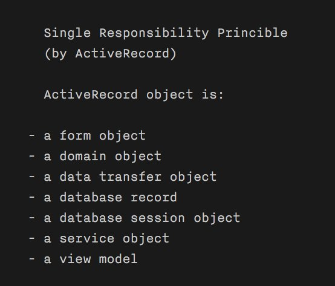
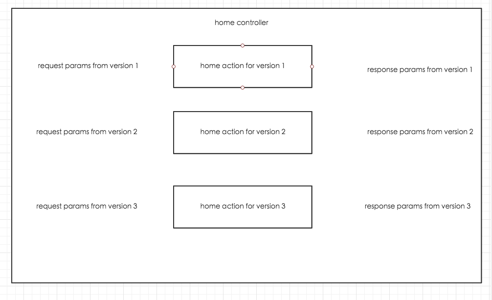
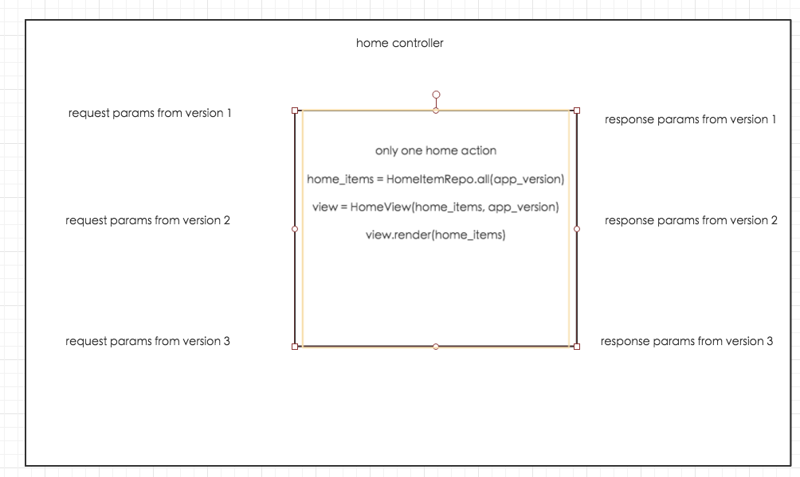

# 菲尼克斯如是说

author: 马陆骋 <malucheng@boohee.com>

## 关于 Phoenix

- Server-side web framework (similar to Rails)
- 基于 Elixir（语法非常类似 Ruby 的函数式编程语言，基于 Erlang 虚拟机）

### Rails 背景

creators

- José Valim was a member of the Rails core team
- Chris also comes from a Rails background.

### 函数式编程

- Elixir is a mostly pure functional programming language.
- Elixir has no objects

## 与 Rails 的主要区别

- 路由
- 参数
- 储存
- 视图

## 路由

router 层就可以进行 filter 的配置, 而不是使用 controller 的继承

### Rails 路由

```ruby
namespace :api, defaults: { format: :json } do
  namespace :v1 do
    get 'home/cards', to: 'home#cards'
  end
end
```

### Phoenix 路由

```elixir
pipeline :browser do
  plug :accepts, ["html"]
  plug :fetch_session
  plug :protect_from_forgery
end

pipeline :api do
  plug :accepts, ["json"]
end

scope "/", MyApp do
  pipe_through :browser
  get "/users", UserController, :index
  ...
end

scope "/api/", MyApp do
  pipe_through :api
  ...
end
```

## 参数处理

Strong Parameter VS Changeset

### 例子1

用户可以通过 API 修改自己的 email 地址和年龄, 但不能修改自己的用户名

```json
"user": {
  "name": "admin",
  "age": 30,
  "email": "user@example.com"
}
```

### Strong Parameter

```ruby
params.require(:user).permit(:age, :email)
```

### Changeset

```elixir
def changeset(model, params \\ :empty) do
  model
  |> cast(params, ~w(age email), [])
end
```

### 例子2

用户可以通过 API 进行注册, 但用户名不能包含关键字 "薄荷"
后台管理员可以任意新建用户, 且用户名没有关键字限制

### Strong Parameter

无法实现具体的验证逻辑, 只能把验证放在 controller 中或模型中.
不过模型的字段验证无法区分修改字段的上下文, 所以只能放在 controller 中.

### Changeset

```elixir
def api_user_changeset(model, params) do
  model
  |> changeset(params)
  |> cast(params, ~w(name), [])
  |> validate_format(:name, ~r/^薄荷/)
end
```

```elixir
def admin_user_changeset(model, params) do
  model
  |> changeset(params)
  |> cast(params, ~w(name), [])
end
```

```elixir
changeset = User.api_user_changeset(%User{}, user_params)
UserRepo.insert(changeset)

changeset = User.admin_user_changeset(%User{}, user_params)
UserRepo.insert(changeset)
```

## 储存

仓库模式(类 ORM) vs ActiveRecord

### Phoenix 使用 Repo 抽象了数据层

> A repository is an API for holding things.
This interface should allow us to rapidly test the application
test our views and templates with simple hardcoded maps.

> Later, we can replace our hardcoded implementation
with a full database-backed repository. Said another way, we want to separate
the concerns of the data from concerns of the database.

### Rails 使用 ActiveRecord 模式

模型可以对自己进行 CRUD 的操作, 缺点是写入和读取时都缺乏灵活性.

## View 层

View Modle (with template) VS Simple View

### Phoenix 的 View 层

> In many other web frameworks, the terms view and template are often used synonymously.
It’s enough for users to know that when a controller finishes a task, a view is somehow rendered.

> In Phoenix, the terminology is a little more explicit. A view is a module containing rendering functions that convert data into a format the end user will consume, like HTML or JSON.

> In short, views are modules responsible for rendering.

### 例子

展示用户的 first name, 假设用户 User(name: "John Smith")

### Rails

```ruby
class User
  def first_name
    name.split(" ").first
  end
end
```

```ruby
<p>first name is <%= @user.first_name %></p>
```

### Elixir

```elixir
defmodule App.UserView do
  use App.Web, :view
  alias App.User

  def first_name(%User{name: name}) do
    name
    |> String.split(" ")
    |> Enum.at(0)
  end
end
```

```elixir
<p>first name is <%= first_name(@user) %></p>
```

## 测试

对比 view 层的测试

### 测试 Phoenix 的 View

```elixir
# repo
def all(App.User) do
  [
    %Rumbl.User{id: "1", name: "José", username: "josevalim", password: "elixir"},
    %Rumbl.User{id: "2", name: "Bruce", username: "redrapids", password: "7langs"},
    %Rumbl.User{id: "3", name: "Chris", username: "chrismccord", password: "phx"}
  ]
end
```

```elixir
users = Repo.all(App.User)
render conn, "index.html", users: users
```

### 测试 Rails 的 View

1. 使用 FactoryGirls 或者 Fixtures 在测试数据库上建立测试数据
2. 访问 view 对应的 controller, 并获取 Response
3. 对比 Response 与期望的结果

## 总结

Phoenix 比 Rails 拥有更多的"层(layer)"

面对逻辑修改时更容易修改



## 目前的问题

- 客户端请求参数多样

- 返回值也很多样

- 持久化方式多样

## 问题1: 同一请求不同上下文与返回值

根据系统或版本的不同, 需要返回不同的返回值

### 目前的做法



### 可能的改进



### 可能的改进(伪代码)

```ruby
def main
  home_items = HomeItemRepo.all(@app_version)
  @view = HomeView.render("home_#{@app_version}.jbuilder", home_items: home_items)
  @view.render
end
```

## 问题2: 前端传参不一致

关于用户性别的可能情况:

|            |   男 |  女   | 男   | 女  |
| --------   | -----:  | :----:  |:----:  |:----:  |
| gender     | 1    |   2  | male | female  |
| sex        |  1   | 2    | male | female     |


### 目前的做法

```ruby
if gender = params[:gender] || params[:sex]
  if gender.to_s == "1" || gender.to_s == "male"
    # set male
  else
    # set female
  end
end
```

### 可能的改进

```ruby
class UserChangeSet
  def initial(params)
    gender = params.delete[:gender] || params.delete[:sex]
    if gender.to_s == "1" || gender.to_s == "male"
      params[:gender] = "male"
    else
      params[:gender] = "female"
    end
    params
  end
end
user.update_attributes(UserChangeSet.new(params[:user]))
```

```ruby
class UserRepo
  def self.insert(params)
    gender = params.delete[:gender] || params.delete[:sex]
    if gender.to_s == "1" || gender.to_s == "male"
      params[:gender] = "male"
    else
      params[:gender] = "female"
    end
    User.create(params)
  end
end
UserRepo.inssert(params[:user])
```

## 持久层多样化

mongo mysql redis

### 目前的做法

```ruby
# comments_controller.rb

def muti_destroy
  if params[:comment_ids].present?
    params[:comment_ids].each do |comment_id|
      if comment = StandaloneComment.find(comment_id.to_i)
        unless comment.deleted?
          comment.destroy
        end
      else
        if (post = Post.find_by("comments._id" => comment_id.to_i)) && !post.deleted?
          if (comment = post.real_comments.find(comment_id)) && !comment.deleted?
            comment.destroy
          end # comment
        end # post
        if comment = PostComment.find_by_id(comment_id)
          !comment.deleted? && comment.destroy
        end
      end
    end
  end
end
```

### 可能的改进

```ruby
# 所有的复杂逻辑都封装到仓库中
def muti_destroy
  if comment_ids = params[:comment_ids].present?
    CommentRepo.muti_destroy(comment_ids)
  end
end
```

## 思考

Rails 的快速开发方式适用于整个应用都能被完全掌控的情况(包括客户端也能随时修改, 几乎只能选择 web 形式).

整个系统的所有组件都遵守同一套规范, 并且可以统一进行修改.

适当添加新的 layer 可以缓解不同组件之间的强耦合, 使应用更健壮.
